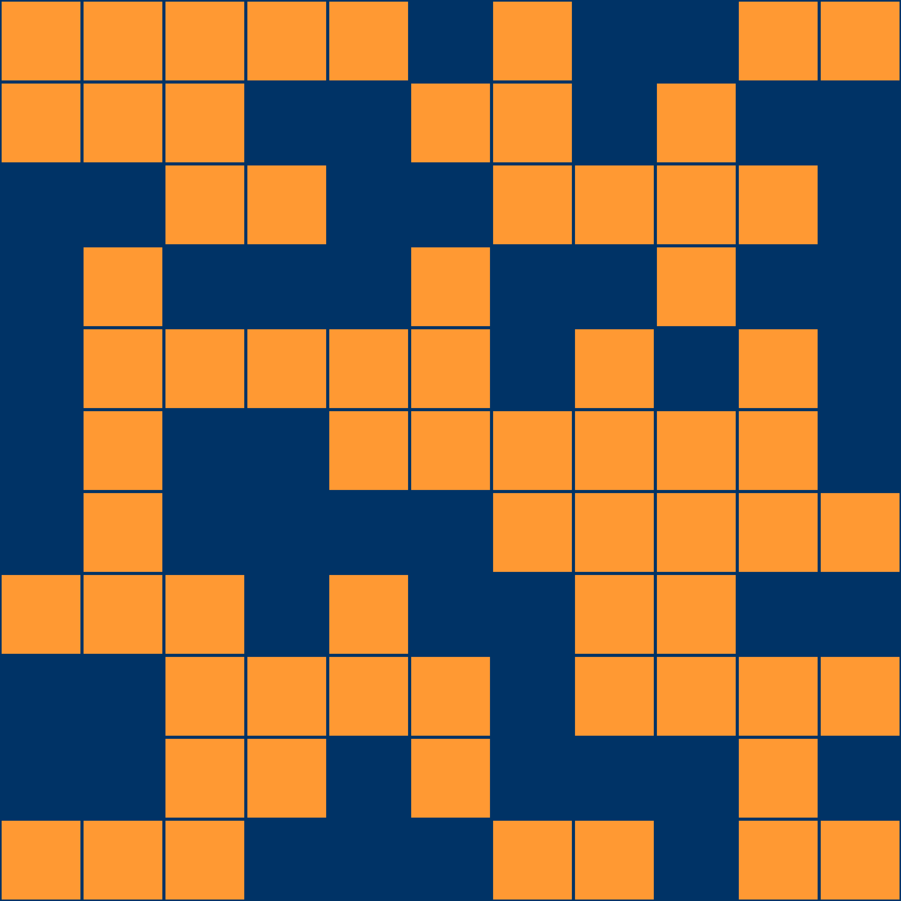

## Preview



# Identicon_avatar
使用SHA或AES算法创建独一无二的、符合美学的Identicon。

Avatar Generator 是一个基于文本生成美学优化头像的工具。该项目通过输入一个文本（例如邮箱或用户名），生成一个固定尺寸的头像图像，并将生成依据嵌入到图像的元数据中。整个生成流程的总体逻辑如下：

- **总体逻辑**  
  - 将输入文本转化为种子（AES 版本使用 AES CTR 模式进行可逆加密；MD5 版本使用 MD5 哈希进行不可逆转换）。
  - 根据种子选择预设的两色调色板（四组搭配：蓝橙、赛博朋克、互补色、柔和中性色调），其中第一种颜色用作背景色，第二种颜色用作填充色。
  - 生成一幅 5500×5500 像素的图像，划分为 11×11 个网格（每个网格 500×500 像素）。
  - 每个网格内部预留 10 像素作为留白，使得每个单元格更有呼吸感。
  - 对于每个网格，以 50% 的概率在预留区域内绘制一个正方形（填充色）；否则保持背景色。
  - 不添加任何外部边框。
  - 将生成依据（AES 版本为加密数据，MD5 版本为 MD5 哈希值）以十六进制字符串嵌入 PNG 元数据中。

本项目提供两种版本：

1. **AES 版本（可逆）**  
   使用 AES CTR 模式对输入文本进行加密，密钥由用户自定义，经 SHA256 派生为 32 字节 AES 密钥。加密结果的前 16 字节作为种子，保证相同输入和密钥生成相同头像；同时生成的加密数据嵌入图像元数据中，可通过还原程序利用相同密钥还原原始文本。

2. **MD5 哈希 版本（不可逆）**  
   使用 MD5 哈希对输入文本计算哈希值，16 字节哈希值作为种子，同样选择预设调色板并生成头像。生成依据（哈希值）嵌入 PNG 元数据中，但哈希不可逆，无法从中还原原始文本。

---

## 使用步骤（AES-256可逆加密版本）

1. **克隆仓库**  
   克隆本项目到本地：
   ```bash
   git clone <https://github.com/Anonymous0632/Identicon_avatar.git>
2. **运行文件**
   ```bash
   python AES256_avatar.py
3. **输入必要信息以生成图片**
   ```bash
   "请输入用于生成头像的文本（例如邮箱或用户名）："
   "请输入加密密钥（任意字符串）："
按照提示输入即可。

## 使用步骤（哈希运算不可逆版本）

1. **克隆仓库**  
   克隆本项目到本地：
   ```bash
   git clone <https://github.com/Anonymous0632/Identicon_avatar.git>
2. **运行文件**
   ```bash
   python SHA-256_AVATAR.py
3. **输入必要信息以生成图片**
   ```bash
   "请输入用于生成头像的文本（例如邮箱或用户名）："
按照提示输入即可。
> [!NOTE]
> 注意：MD5 版本生成的哈希值嵌入在图像中，但由于哈希不可逆，无法还原原始文本.

## 使用步骤（AES-256图像解密程序）

1. **克隆仓库**  
   克隆本项目到本地：  
   ```bash
   git clone https://github.com/Anonymous0632/Identicon_avatar.git
   ```

2. **运行文件**  
   进入项目文件夹并运行：  
   ```bash
   python restore_text.py
   ```

3. **输入需要解密的图像路径**  
   输入包含嵌入密文的图像文件路径：  
   ```bash
   "请输入包含嵌入密文的图像文件路径（例如 avatar.png）："
   ```

4. **输入需要解密的图像密钥**  
   输入用于解密的加密密钥：  
   ```bash
   "请输入加密密钥："
   ```

按照提示输入即可解密图像内容。

AES 版本 适用于需要可逆加密（通过密钥还原原始文本）的场景。
MD5 哈希 版本 适用于只需生成固定头像，不需还原文本的场景。

---

Happy Avatar Generating!
